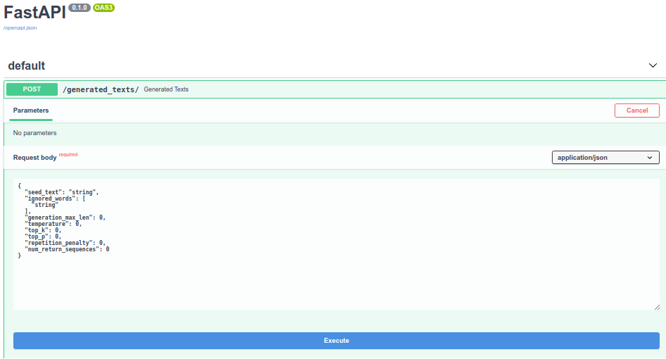
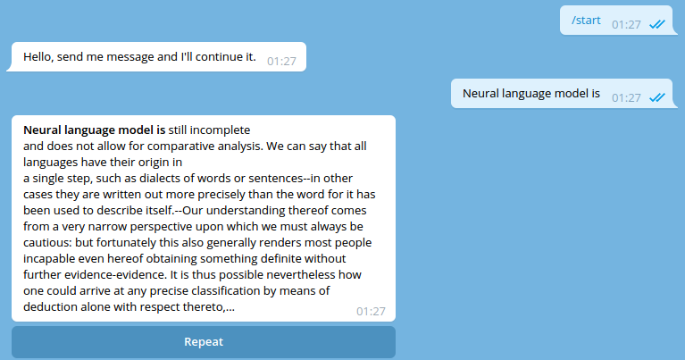

# Full Stack Transformer
Pytorch library for end-to-end transformer models training, inference and serving.
<br>
<br>
Powered by:
- [tokenizers](https://github.com/huggingface/tokenizers) fast tokenization and dataset preparation
- [transformers](https://github.com/huggingface/transformers) model backbones
- [pytorch-lightning](https://github.com/PyTorchLightning/pytorch-lightning) training process
- [fastapi](https://github.com/tiangolo/fastapi) application serving
- [aiogram](https://github.com/aiogram/aiogram) telegram bot serving

Also, I predominantly work with russian texts, so I actively used pre-trained gpt-model
and tokenizer (which I wrapped in the fast sentence piece tokenizer from 
[tokenizers](https://github.com/huggingface/tokenizers) library)
from the [ru_transformers](https://github.com/mgrankin/ru_transformers) repository.

## Features
- Automatic LM dataset preparation 
- End-to-end transformer LM training
- [Unlikelihood loss](https://arxiv.org/pdf/1908.04319.pdf) training
- Text generation tricks (top-k, [nucleus](http://arxiv.org/abs/1904.09751), repetition penalty, etc)
- Text generation as a service
- Telegram bot client

## End-to-end Example
As they say, it’s better to see once...<br>
So, let's go through the whole pipeline from dataset building to the application
serving on the [nietzsche](data/documents/nietzsche) texts example.

### Prepare dataset
First, you need two text files (train and validation) which contain raw documents.
For this example, files are already placed here:
```
data/documents/nietzsche/
├── train.txt
└── valid.txt
```
(If you want to start with your own files, check 
[Input Document Files Format](#input-document-files-format)

Files are in place and we are ready to prepare the dataset:
```
python full_stack_transformer/scripts/prepare_dataset.py \
--documents_train_file data/documents/nietzsche/train.txt \
--documents_valid_file data/documents/nietzsche/valid.txt \
--end_of_document "[END_OF_DOCUMENT]" \
--tokenizer_cls_name GPT2Tokenizer \
--max_sample_length 128 \
--min_sample_length 8 \
--datasets_root data/datasets \
--dataset_name nietzsche
```

For this example we'll use the `gpt2` model, weights of which 
are available from the huggingface server. That's why, we have 
`--tokenizer_cls_name=GPT2Tokenizer` argument here. If you want to fine tune
another model (with another tokenizer), check
[Available Tokenizers](#available-tokenizers)

The dataset has been created, here is its directory structure:
```
data/datasets/nietzsche/
└── 0
    ├── description.json
    ├── train
    │   ├── corpus.npy
    │   └── sample_start_positions.npy
    └── valid
        ├── corpus.npy
        └── sample_start_positions.npy
```

We have the dataset, now we are ready to train the model.

### Train Model
The library uses `pytorch-lightning` for training and arguments which are used by
lightning `Trainer` class is allowed as a command-line argument for the script below.

To check them all execute:
```
python full_stack_transformer/scripts/train_model.py --help
```

Now, let's train the model:
```
python full_stack_transformer/scripts/train_model.py \
--seed 228 \
--dataset_dir data/datasets/nietzsche/0 \
--model_path gpt2 \
--batch_size 4 \
--learning_rate 2.5e-05 \
--num_warmup_steps 200 \
--num_cycles 1 \
--gradient_clip_val 5.0 \
--accumulate_grad_batches 4 \
--max_epochs 10 \
--val_check_interval 330 \
--gpus "0," \
--log_text_samples \
--unlikelihood_alpha 100
```

If you don't have `gpt2` model downloaded, it'll be obtained from the huggingface server (548M).
Also, if you want to use a pre-trained gpt weights, which are stored locally, pass the path
to the model directory, like so: `--model_path path/to/local/gpt/model`.

The training has been started. All experiment related files a placed in the experiment directory:
```
data/experiments/nietzsche/0/
├── _ckpt_epoch_0.ckpt
├── _ckpt_epoch_1.ckpt
├── description.json
├── generated.txt
├── logs
│   ├── critical.log
│   ├── debug.log
│   ├── errors.log
│   └── info.log
└── text_generator_params.json
```

### Monitor training
Run `tensorboard`:
```
tensorboard --logdir=./data/tb_logs/ --port=6006
```
TensorBoard interface is available here: [http://localhost:6006/](http://localhost:6006/)
<br>


Also, text samples are generated during the training on each validation step.
They are logged here:
```
cat data/experiments/nietzsche/0/generated.txt
```
```
...
{
    "Global step": 250,
    "Current epoch": 2,
    "Generator params": {
        "seed_text": null,
        "ignored_words": null,
        "generation_max_len": 64,
        "temperature": 0.7,
        "top_k": 50,
        "top_p": 1.0,
        "repetition_penalty": 5.0,
        "num_return_sequences": 16
    },
    "Error message": null,
    "Generated samples": [
        "and\nthe greatest of all philosophers.",
...
```

Text generator parameters could be changed here:
```text
cat data/experiments/nietzsche/0/text_generator_params.json
```

Changed parameters will be applied on the next validation step.

### Serve application

When the model is trained, it could be served for inference:
```
./scripts/run_text_generator_service.sh 9228 1 ./logs ./data/experiments/nietzsche/0/_ckpt_epoch_2.ckpt cuda:0
```

Swagger is available here: [http://localhost:9228/docs](http://localhost:9228/docs)
<br>



### Serve telegram bot
If you want to play with the text generation via telegram bot, you need the service run
(previous step). Also, you need to obtain telegram api token. It could be easily done
via [@BotFather](https://t.me/botfather).

After you run the application server and got the api token, execute the following:
```
python full_stack_transformer/scripts/run_text_generator_telegram_client.py \
--telegram_api_token="API-TOKEN-OBTAINED-FROM-BOTFATHER" \
--text_generator_service_url=http://localhost:9228/
```

That's it. Go find your bot in telegram and chat:



## Inference
After you train the model, you may want to perform inference in code. You can
use `TextGenerator` object for this:
```python
import torch

from full_stack_transformer.pl_modules.model_loading import (
    load_text_generator_from_pl_checkpoint)
from full_stack_transformer.text_generator.text_generator import (
    TextGeneratorParams)

if __name__ == '__main__':
    ckpt = torch.load('./data/experiments/nietzsche/0/_ckpt_epoch_2.ckpt')

    text_generator = load_text_generator_from_pl_checkpoint(
        ckpt=ckpt, device='cuda:0')

    params = TextGeneratorParams(
        seed_text='Love is',
        ignored_words=None,
        generation_max_len=12,
        temperature=0.7,
        top_k=50,
        top_p=1.0,
        repetition_penalty=5.0,
        num_return_sequences=16)

    generated_texts = text_generator(params)

    for text in generated_texts[:3]:
        print(text)
```
```
the source of all good
and great love: it is
the most dangerous thing in all of us, and we have
```

## Input Document Files Format
Raw input document files (train and valid) contains documents, separated by 
some delimiter string. 

For example:
```
Document 1
Some text
And more text
[END_OF_DOCUMENT]
Document 2
[END_OF_DOCUMENT]
Last document in the corpus
Some text
[END_OF_DOCUMENT]
```

In this example there are 3 documents, separated by `[END_OF_DOCUMENT]` string.
Documents separator must be placed on a new line. So, no other symbols allowed on the
document separator line (of course except the new line `\n` token on the end of line).

## Available Tokenizers
For now, there are two tokenizers available.

- `GPT2Tokenizer` for huggingface models:
    - `gpt2`
    - `gpt2-medium`
    - `gpt2-large`
    - `gpt2-xl`
    - `distilgpt2`
    - maybe, there are some more models already. 
    Check [official huggingface repo](https://github.com/huggingface/transformers/blob/master/src/transformers/configuration_gpt2.py)
- `RuTransformersTokenizer`:
    - [ru_transformers](https://github.com/mgrankin/ru_transformers) medium size model
    